# מפת ניתוח נתיבים ורכיבים באפליקציה

<ctrl94>thought
<ctrl95>

מסמך זה מציג מיפוי ארכיטקטוני מלא של הנתיבים באפליקציה, הרכיבים הפעילים בהם וקובצי המקור המתאימים. המידע מאורגן באמצעות תרשים זרימה (אינפוגרפיקה) וטבלה מסודרת המותאמת לכללי RTL.

## תרשים זרימה: מבנה הנתונים והניווט באפליקציה

```mermaid
graph TD
    classDef default fill:#0f172a,stroke:#334155,stroke-width:2px,color:#f8fafc;
    classDef root fill:#1e1b4b,stroke:#4f46e5,stroke-width:3px,color:#f8fafc;
    classDef admin fill:#451a03,stroke:#d97706,stroke-width:3px,color:#f8fafc;
    classDef dashboard fill:#022c22,stroke:#059669,stroke-width:3px,color:#f8fafc;
    classDef dynamic fill:#311042,stroke:#9333ea,stroke-width:3px,color:#f8fafc;

    Root["/ (עמוד הבית)"]:::root
    
    %% Admin Routes
    AdminLayout["/admin (תבנית מנהל)"]:::admin
    AdminDashboard["/admin (ראשי)"]:::admin
    AdminUsers["/admin/users (ניהול משתמשים)"]:::admin
    AdminReceipts["/admin/receipts (הפקת קבלות)"]:::admin
    AdminFormBuilder["/admin/form-builder (מחולל טפסים)"]:::admin
    AdminContent["/admin/content (תוכן אתר)"]:::admin
    AdminSettings["/admin/settings (הגדרות API)"]:::admin
    
    %% User Dashboard Routes
    DashLayout["/dashboard (תבנית משתמש)"]:::dashboard
    DashWelcome["/dashboard/welcome (שלבי קליטה)"]:::dashboard
    DashHome["/dashboard (ראשי ו-Onboarding)"]:::dashboard
    DashCRM["/dashboard/crm (ניהול קהילה)"]:::dashboard
    DashReceipts["/dashboard/receipts (הפקת מסמך)"]:::dashboard
    DashServices["/dashboard/services (יצירת תוכן)"]:::dashboard
    DashAutomations["/dashboard/automations (אוטומציה)"]:::dashboard
    DashCampaigns["/dashboard/campaigns (קמפיינים)"]:::dashboard
    DashSettings["/dashboard/settings (הגדרות)"]:::dashboard
    DashExpenses["/dashboard/expenses (הוצאות)"]:::dashboard
    DashCalendar["/dashboard/calendar (יומן פעילות)"]:::dashboard
    
    %% Dynamic & Public Routes
    DynamicLanding["/[id] (עמודי נחיתה דינמיים)"]:::dynamic
    DynamicPost["/post/[slug] (מאמר דינמי)"]:::dynamic
    DynamicService["/service/[slug] (שירות דינמי)"]:::dynamic
    Checkout["/checkout (רכישה)"]:::dynamic
    CheckoutSuccess["/checkout/success (אישור תשלום)"]:::dynamic

    %% Relationships
    Root --> AdminLayout
    Root --> DashLayout
    Root --> DynamicLanding
    
    AdminLayout --> AdminDashboard
    AdminLayout --> AdminUsers
    AdminLayout --> AdminReceipts
    AdminLayout --> AdminFormBuilder
    AdminLayout --> AdminContent
    AdminLayout --> AdminSettings
    
    DashLayout --> DashWelcome
    DashLayout --> DashHome
    DashLayout --> DashCRM
    DashLayout --> DashReceipts
    DashLayout --> DashServices
    DashLayout --> DashAutomations
    DashLayout --> DashCampaigns
    DashLayout --> DashSettings
    DashLayout --> DashExpenses
    DashLayout --> DashCalendar
    
    DashCRM --> DynamicLanding
    DashServices --> DynamicService
    DashCampaigns --> DynamicPost
    
    DynamicLanding --> Checkout
    Checkout --> CheckoutSuccess
```

---

## טבלת מיפוי נתיבים ורכיבים באפליקציה

| נתיב (Route) | שם העמוד / תפקיד | קומפוננטות מרכזיות | קובץ מקור (Source File) |
| :--- | :--- | :--- | :--- |
| **`/`** | עמוד הבית המרכזי / המיני-סייט | `HomeClient`, `HomeEditor`, `Navbar`, `Footer`, `WhatsAppButton`, `Hero`, `ServicesGrid`, `CommunitySection` | [page.tsx](file:///c:/Users/ovt57/Downloads/drive-download-20260624T081257Z-3-001/src/app/page.tsx) |
| **`/admin`** | ראשי - מנהל מערכת גלובלי | `AdminLayout`, `AdminDashboard`, `UsersTable` | [page.tsx](file:///c:/Users/ovt57/Downloads/drive-download-20260624T081257Z-3-001/src/app/admin/page.tsx) |
| **`/admin/users`** | ניהול משתמשים ואנשי קשר גלובלי | `CRMDashboardPage` (תצוגת CRM מנהל) | [page.tsx](file:///c:/Users/ovt57/Downloads/drive-download-20260624T081257Z-3-001/src/app/admin/users/page.tsx) |
| **`/admin/receipts`** | הפקת קבלות ידנית למערכת קשר | `KesherManualReceiptsForm` | [page.tsx](file:///c:/Users/ovt57/Downloads/drive-download-20260624T081257Z-3-001/src/app/admin/receipts/page.tsx) |
| **`/admin/form-builder`** | מחולל הטפסים מבוסס AI של מיכאל | `AdminFormBuilderClient`, `CRMFormBuilder`, `CRMFormRenderer` | [page.tsx](file:///c:/Users/ovt57/Downloads/drive-download-20260624T081257Z-3-001/src/app/admin/form-builder/page.tsx) |
| **`/admin/content`** | ניהול תוכן ושירותי האתר הראשי | `ServicesDashboardClient` | [page.tsx](file:///c:/Users/ovt57/Downloads/drive-download-20260624T081257Z-3-001/src/app/admin/content/page.tsx) |
| **`/admin/settings`** | הגדרות API ומפתחות מערכת גלובליים | `AdminSettingsClient` | [page.tsx](file:///c:/Users/ovt57/Downloads/drive-download-20260624T081257Z-3-001/src/app/admin/settings/page.tsx) |
| **`/dashboard`** | ראשי - מפת מיתוג ושלבי התחלה (Onboarding) | `DashboardShell`, `DashboardClient`, `BrandingTab`, `SocialNetworksTab`, `ContactDetailsTab`, `CreateCommunityTab`, `ServicesTab` | [page.tsx](file:///c:/Users/ovt57/Downloads/drive-download-20260624T081257Z-3-001/src/app/dashboard/page.tsx) |
| **`/dashboard/crm`** | ניהול קהילה ו-CRM | `CRMDashboardPage`, `ContactModal`, `ImportExportModal`, `MessageModal` | [page.tsx](file:///c:/Users/ovt57/Downloads/drive-download-20260624T081257Z-3-001/src/app/dashboard/crm/page.tsx) |
| **`/dashboard/receipts`** | הפקת מסמך / קבלה ידנית למשתמש | `KesherManualReceiptsForm` | [page.tsx](file:///c:/Users/ovt57/Downloads/drive-download-20260624T081257Z-3-001/src/app/dashboard/receipts/page.tsx) |
| **`/dashboard/services`** | יצירת תוכן, עמודים ושירותים | `ServicesDashboardClient`, `ServiceForm`, `ServiceListClient` | [page.tsx](file:///c:/Users/ovt57/Downloads/drive-download-20260624T081257Z-3-001/src/app/dashboard/services/page.tsx) |
| **`/dashboard/automations`** | תהליכים אוטומטיים וחיבורים חיצוניים | `GenericCanvas` (לוח אוטומציה מונחה-AI) | [page.tsx](file:///c:/Users/ovt57/Downloads/drive-download-20260624T081257Z-3-001/src/app/dashboard/automations/page.tsx) |
| **`/dashboard/campaigns`** | שליחת קמפיינים ודיוור שיווקי | `GenericCanvas` (לוח קמפיינים שיווקיים) | [page.tsx](file:///c:/Users/ovt57/Downloads/drive-download-20260624T081257Z-3-001/src/app/dashboard/campaigns/page.tsx) |
| **`/dashboard/settings`** | הגדרות פרופיל, יומן, וואטסאפ וסליקה | `SettingsTabs`, `UserProfileSettingsForm`, `KesherSettingsForm`, `GoogleSettingsCard`, `WhatsAppSettingsForm`, `AiSettingsForm` | [page.tsx](file:///c:/Users/ovt57/Downloads/drive-download-20260624T081257Z-3-001/src/app/dashboard/settings/page.tsx) |
| **`/dashboard/expenses`** | ניהול והיסטוריית הוצאות וקבלה | `ExpenseForm`, `ExpensesList` | [page.tsx](file:///c:/Users/ovt57/Downloads/drive-download-20260624T081257Z-3-001/src/app/dashboard/expenses/page.tsx) |
| **`/dashboard/calendar`** | יומן משימות ואירועים מסונכרן | `CalendarView` (תצוגת יומן מבוססת גוגל) | [page.tsx](file:///c:/Users/ovt57/Downloads/drive-download-20260624T081257Z-3-001/src/app/dashboard/calendar/page.tsx) |
| **`/dashboard/welcome`** | אשף הגדרות והדרכת הצטרפות (Wizard) | `WelcomeDashboardClient`, `OnboardingWizard` | [page.tsx](file:///c:/Users/ovt57/Downloads/drive-download-20260624T081257Z-3-001/src/app/dashboard/welcome/page.tsx) |
| **`/dashboard/mosaic`** | תפריט מהיר בפריסת פסיפס (Desktop) | קישורי ניווט מותאמים לגריד דסקטופ | [page.tsx](file:///c:/Users/ovt57/Downloads/drive-download-20260624T081257Z-3-001/src/app/dashboard/mosaic/page.tsx) |
| **`/[id]`** | עמוד נחיתה דינמי | `HomeClient` (סקשנים מותאמים לעמוד הנחיתה מה-DB) | [page.tsx](file:///c:/Users/ovt57/Downloads/drive-download-20260624T081257Z-3-001/src/app/[id]/page.tsx) |
| **`/post/[slug]`** | עמוד פוסט / מאמר מפורט | `HomeClient` (תצוגת תוכן פוסט) | [page.tsx](file:///c:/Users/ovt57/Downloads/drive-download-20260624T081257Z-3-001/src/app/post/[slug]/page.tsx) |
| **`/service/[slug]`** | עמוד שירות / עסק מפורט | `HomeClient` (תצוגת תוכן שירות) | [page.tsx](file:///c:/Users/ovt57/Downloads/drive-download-20260624T081257Z-3-001/src/app/service/[slug]/page.tsx) |
| **`/checkout`** | עמוד סיכום הזמנה ותשלום | `CheckoutContent` | [page.tsx](file:///c:/Users/ovt57/Downloads/drive-download-20260624T081257Z-3-001/src/app/checkout/page.tsx) |
| **`/checkout/success`** | עמוד אישור והצלחת תשלום | `SuccessContent` | [page.tsx](file:///c:/Users/ovt57/Downloads/drive-download-20260624T081257Z-3-001/src/app/checkout/success/page.tsx) |

---

> [!NOTE]
> כלל העמודים וקומפוננטות ה-UI הציבוריות מתורגמות ומעוצבות לפי שפת המותג של פרויקט **Golden Flute** ומסודרות לתמיכה מלאה בכתיבה מימין לשמאל (RTL).

